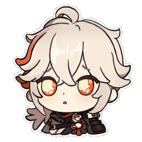

<!-- PROJECT LOGO -->
<br />
<div align="center">
    
  </a>
  <br />
  <br />

[![Contributors][contributors-shield]][contributors-url]
[![Forks][forks-shield]][forks-url]
[![Stargazers][stars-shield]][stars-url]
[![MIT License][license-shield]][license-url]

<h3 align="center">Frontend Mentor - QR code component solution</h3>

This is a solution to the [QR code component challenge on Frontend Mentor](https://www.frontendmentor.io/challenges/qr-code-component-iux_sIO_H).

  <p align="center">   
<br />
    <br />
    <br />
    <a href="https://sedaryildirim.github.io/qr-code-component-main/">View Site</a>
    ·
    <a href="https://github.com/sedaryildirim/qr-code-component-main/issues">Report Bug</a>
    ·
    <a href="https://github.com/sedaryildirim/qr-code-component-main/issues">Request Feature</a>
  </p>
</div>


## Table of contents

- [Overview](#overview)
  - [Screenshot](#screenshot)
  - [Links](#links)
- [My process](#my-process)
  - [Built with](#built-with)
  - [What I learned](#what-i-learned)
  - [Continued development](#continued-development)
  - [Useful resources](#useful-resources)
- [Author](#author)
- [Acknowledgments](#acknowledgments)


## Overview

### Screenshot

<div align="center">


</div>

### Links

- Solution URL: [Add solution URL here](https://your-solution-url.com)
- Live Site URL: [Add live site URL here](https://your-live-site-url.com)

## My process

### Built with

- Semantic HTML5 markup
- CSS custom properties
- Flexbox
- CSS Grid
- Mobile-first workflow
- [React](https://reactjs.org/) - JS library
- [Next.js](https://nextjs.org/) - React framework
- [Styled Components](https://styled-components.com/) - For styles


### What I learned

Use this section to recap over some of your major learnings while working through this project. Writing these out and providing code samples of areas you want to highlight is a great way to reinforce your own knowledge.

To see how you can add code snippets, see below:

```html
<h1>Some HTML code I'm proud of</h1>
```
```css
.proud-of-this-css {
  color: papayawhip;
}
```
```js
const proudOfThisFunc = () => {
  console.log('🎉')
}
```

If you want more help with writing markdown, we'd recommend checking out [The Markdown Guide](https://www.markdownguide.org/) to learn more.


### Continued development

Use this section to outline areas that you want to continue focusing on in future projects. These could be concepts you're still not completely comfortable with or techniques you found useful that you want to refine and perfect.


### Useful resources

- [Example resource 1](https://www.example.com) - This helped me for XYZ reason. I really liked this pattern and will use it going forward.
- [Example resource 2](https://www.example.com) - This is an amazing article which helped me finally understand XYZ. I'd recommend it to anyone still learning this concept.


## Author

- Website - [Add your name here](https://www.your-site.com)
- Frontend Mentor - [@yourusername](https://www.frontendmentor.io/profile/yourusername)
- Twitter - [@yourusername](https://www.twitter.com/yourusername)


## Acknowledgments

This is where you can give a hat tip to anyone who helped you out on this project. Perhaps you worked in a team or got some inspiration from someone else's solution. This is the perfect place to give them some credit.

<!-- MARKDOWN LINKS & IMAGES -->
<!-- https://www.markdownguide.org/basic-syntax/#reference-style-links -->
[contributors-shield]: https://img.shields.io/github/contributors/sedaryildirim/qr-code-component-main.svg?style=for-the-badge
[contributors-url]: https://github.com/sedaryildirim/qr-code-component-main/graphs/contributors
[forks-shield]: https://img.shields.io/github/forks/sedaryildirim/qr-code-component-main.svg?style=for-the-badge
[forks-url]: https://github.com/sedaryildirim/qr-code-component-main/network/members
[stars-shield]: https://img.shields.io/github/stars/sedaryildirim/qr-code-component-main.svg?style=for-the-badge
[stars-url]: https://github.com/sedaryildirim/qr-code-component-main/stargazers
[license-shield]: https://img.shields.io/github/license/sedaryildirim/qr-code-component-main.svg?style=for-the-badge
[license-url]: https://github.com/sedaryildirim/qr-code-component-main/blob/main/LICENSE.txt
[product-screenshot]: imgs/screenshot.png
